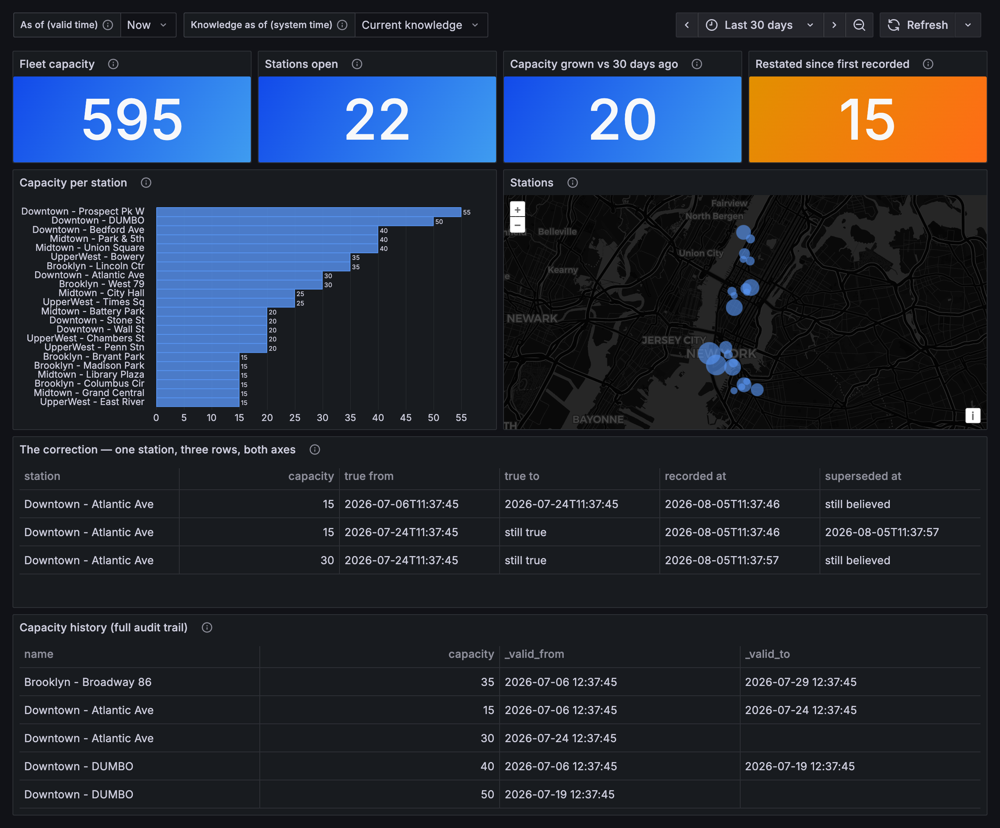
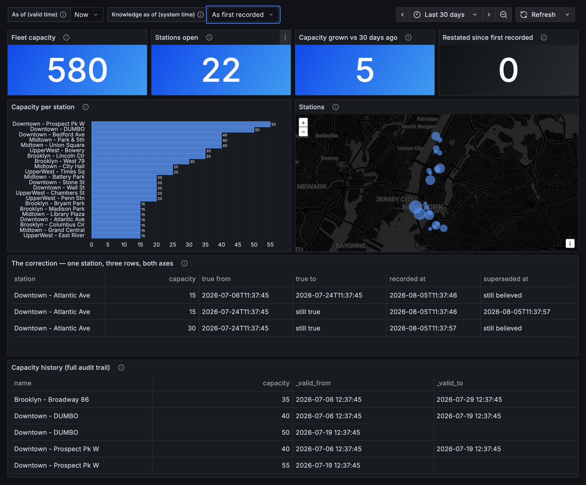

# Bikeshare on Grafana

Grafana's **stock PostgreSQL data source** pointed at XTDB. No plugin, no fork.

Two dashboards:

- `bikeshare` — an ordinary operational dashboard. Stat tiles, time series, donuts,
  a geomap, a table. The point is that it is unremarkable: this is what any Postgres
  data source gets you.
- `bikeshare-asof` — the same stations, with **two dropdowns**. *As of* rewinds valid
  time: what was true in the world. *Knowledge as of* rewinds system time: what the
  database had recorded at the time. Neither is available anywhere else, and the
  second one is the one nothing else can fake.

Same instant of the world, two different records of it — the fleet is 15 bikes
larger once you read it at current knowledge:





## Run it

Requires Docker and [uv](https://docs.astral.sh/uv/).

```bash
docker compose up -d          # XTDB on :5442, Grafana on :3002
uv run seed.py                # ~24 stations, ~12k rides, 30 days, one correction
open http://localhost:3002
```

Grafana is provisioned with the data source and both dashboards already loaded,
and anonymous admin access is on, so there is no login step.

Tear down with `docker compose down -v`.

XTDB's host port is **5442**, not 5432. Anything already bound to 5432 — a local
Postgres, another XTDB, a dev REPL — wins that port silently on macOS, and then
`seed.py` writes to *that* node while Grafana, which reaches XTDB over the compose
network, queries an empty one. Every panel says "No data" and nothing tells you
why. `verify.py` now cross-checks the two paths so this can't pass unnoticed.

## What the as-of dashboard does

Every stations panel pins both axes:

```sql
SELECT name, capacity
FROM stations
FOR VALID_TIME  AS OF (NOW() - INTERVAL '${days_back}' DAY)
FOR SYSTEM_TIME AS OF TIMESTAMP '${basis}'
ORDER BY capacity DESC
```

`days_back` is a plain custom variable. `basis` is a query variable listing the
distinct `_system_from` values on `stations` — the transaction times XTDB assigned
— so the dropdown offers *As first recorded* and *Current knowledge* without
anything hardcoding a timestamp.

**Valid time** comes from the seed writing each station as a series of versions
with explicit `_valid_from` / `_valid_to` bounds: capacity expansions, a couple of
mid-window closures, a couple of late openings. Moving *As of* from Now to 14 days
ago changes the fleet total, drops the stations that hadn't opened yet, and
restores the ones since closed.

**System time** comes from a correction. One station's capacity was recorded as 15
when the racks were installed. An audit 12 days ago found 30, and the fix was
filed as a backdated `UPDATE ... FOR PORTION OF VALID_TIME`, in a transaction of
its own:

```sql
UPDATE stations FOR PORTION OF VALID_TIME FROM TIMESTAMP '<audit date>' TO NULL
   SET capacity = 30
 WHERE _id = <station>
```

That makes the two axes disagree, which is the whole point:

| | valid time inside the audited window | valid time before it |
| --- | --- | --- |
| **As first recorded** | 15 | 15 |
| **Current knowledge** | 30 | 15 |

The *Restated since first recorded* tile is that disagreement as one number: bikes
that were true at the selected point but weren't in the books when first recorded.
It reads 0 at *As first recorded* and 15 at *Current knowledge*, and 0 at any *As
of* older than the audit — a bounded restatement, not a rewrite. A history table
gets you the left column. Only the second axis gets you the difference between the
rows.

The *correction* panel shows all three versions of that one station across both
axes, including the belief that was superseded. The *capacity history* panel below
it is the ordinary valid-time audit trail, read at whichever basis is selected.

## Versions

Pinned to **XTDB 2.2.0-rc0**, the first release carrying the catalog functions
Grafana's plugin needs (`quote_ident`, `parse_ident`, `string_to_array`,
`array_lower`, `array_length`, two-arg `generate_series`,
`current_setting('search_path')`, and a `pg_extension` stub). Earlier releases
connect but introspect nothing.

Grafana is pinned to 12.2.

## Verify it

```bash
uv run verify.py
```

Four groups, all of them asserting on content rather than on the absence of
exceptions:

1. **Introspection** — the queries Grafana's plugin issues on its own. Checks carry
   a `min_rows`, because several fail by returning nothing: an empty column list
   means the query builder has no columns to offer, which a bare "did it throw?"
   check waves through.
2. **Panels** — every `rawSql` in both dashboards, with template variables resolved
   the way Grafana resolves them (query variables get run, not guessed at) and
   macros expanded.
3. **Through Grafana** — the same node check described above, plus each variable
   query replayed through `/api/ds/query`. This is the only place a malformed
   template variable shows up without opening a browser: Grafana wants a
   variable's `query` as a raw SQL string and answers 500 for the object form its
   own panel editor writes.
4. **The correction** — that the backdated correction actually produced two
   different beliefs about the same instant, that it stays inside its window, and
   that it reaches the aggregate panels. All four cells of the table above.

It also re-checks the known gaps below and says so if one has started working.
Exits non-zero on any unexpected result, so it works as a CI gate.

## Known gaps

Verified against 2.2.0-rc0 by `verify.py`. All XTDB-side.

**An array-valued function in `FROM` binds no column.**

```sql
SELECT s FROM string_to_array('a,b', ',') s   -- Column not found: s
```

Postgres binds the alias as the function's result column. XTDB accepts the
relation but won't resolve `s`. Grafana's search-path subquery depends on exactly
this, and it breaks the query builder twice over: **table** discovery fails to
plan at all (`Column not found: s` / `Column not found: i`), and **column**
discovery returns 0 rows where the same query without the schema constraint finds
all 10. Panels with hand-written SQL are unaffected, which is why both dashboards
work. `unnest()` works, so there is a rewrite available.

**`GROUP BY` by ordinal is unsupported.**

```sql
SELECT user_type, COUNT(*) FROM rides GROUP BY 1   -- Missing grouping columns
```

`ORDER BY 1` works; `GROUP BY 1` doesn't. Repeat the full expression instead —
which is what the `$__timeGroup` panels here do.

**A subquery can't be a temporal bound.**

```sql
SELECT capacity FROM stations
FOR SYSTEM_TIME AS OF (SELECT MIN(_system_from) FROM stations FOR ALL SYSTEM_TIME)
-- Subqueries are not allowed in this context
```

A panel would otherwise name a knowledge basis by derivation ("as first recorded")
rather than pinning a literal. The dashboard works around it with a Grafana query
variable that resolves the timestamp client-side.

**A cast can't be a temporal bound in DML.** `UPDATE ... FOR PORTION OF VALID_TIME
FROM '...'::timestamptz` is a parse error, though the same cast is fine in a
`SELECT ... AS OF` and in `VALUES`. It bites because that is exactly what a driver
emits for a datetime parameter: `seed.py` spells the bound `TIMESTAMP '...'` by
hand to avoid it.

**The image's Docker healthcheck can never pass.** `HEALTHCHECK` uses `wget
--spider`, i.e. HEAD, and `/healthz/alive` answers 405, so every container
reports `unhealthy` forever and `depends_on: condition: service_healthy`
deadlocks against the official image. This compose file overrides it with a GET.

## Demo rough edges

- Data is synthetic, from a fixed seed. Realistic in shape, invented in substance —
  and the neighbourhood prefixes don't match the station names they're paired with.
- On the `bikeshare` dashboard, categorical colours aren't stable across panels:
  the `user type` and `bike type` donuts reuse the same green/yellow pair for
  different categories.
- Panel queries quote their aliases (`AS "time"`, `AS "hour"`) to sidestep
  reserved-keyword handling.
- Whether Grafana's *visual query builder* populates its dropdowns is untested by
  driving the UI, but the table- and column-discovery gaps above say it won't.
- Grafana only mounts panels near the viewport, so a dashboard taller than one
  screen can't be captured whole. `bikeshare-asof` is laid out to fit; `bikeshare`
  isn't, and its screenshot is the top of it.
